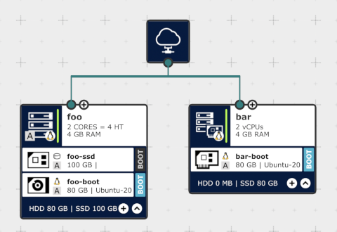

# :cloud: ionos-cloud-init

[](https://opensource.org/licenses/MIT)
[](https://www.frontmark.de/)

Initially developed as part of a working student's project in 2021/2022.

The - dockerized - `cloud-init.py` script leverages the [IONOS Cloud API (6.0)](https://api.ionos.com/docs/cloud/v6/), which can be seen "as an alternative to the 'Data Center Designer' (DCD) browser-based tool" and "can be used to perform a multitude of management tasks, including adding servers, volumes, configuring networks, and so on."

To do so, the `cloud-init.py` script expects a datacenter to be defined with JSON and YAML config files ("Infrastructure as Code"). The JSON files define the servers (`type` of server, e.g., "ENTERPRISE" or "CUBE"; `ram`; `cores`; etc.) and the YAML files can be used to initialize the OS itself (adding users, keys and packages; disk setup; etc.):
The YAML files are essentially `#cloud-configs` as defined by the [cloud-init Documentation](https://cloudinit.readthedocs.io/en/latest/), "the *industry standard* multi-distribution method for cross-platform cloud instance initialization."

To make configs reusable and thus reduce redundancy, the `cloud-init.py` script is able to handle JSON and YAML files with variables (syntax inspired by [Jinja's template variables](https://jinja.palletsprojects.com/en/3.1.x/templates/#variables)):
The JSON files support simple string replacements, so that you can have something like "{{ source-ip }}" in your config file, which will then be replaced with different values depending on the datacenter location (e.g., `de_fra`) at runtime.
The YAML files support simple file inclusions, so that something like `{{ favmd.keys }}` will tell the python script to look for a file named `favmd.keys` (in the datacenter-specific "includes" directory first, then in the global "includes" directory) and insert its contents at runtime.

## Tutorial: the `foobar` datacenter

**Prerequisites**:
- Note that an - *empty* - datacenter named `foobar` is expected to exist. *Create it first!*
- Note that you must have [GNU Make](https://www.gnu.org/software/make/) installed in order to make use of the handy [Makefile](Makefile).

The following "tutorial" will guide you through the creation and deletion of the very simple `foobar` datacenter, which consists of only two servers: the "ENTERPRISE" server `foo`, which has an SSD, used to store data, and a boot disk for the OS; and the "CUBE" server `bar`, which only has a direct attached storage (DAS), but no data drive.
Both servers do have a network interface card (NIC), which is connected to the internet, but all incoming traffic will be blocked by a firewall, except for traffic coming from "{{ source-ip }}" (to be defined in `.de_fra.json`) to SSH port 22.

The YAML files (a.k.a. the `#cloud-configs`) will initialize both servers entirely, so that in the end the user `favmd` can log in as the sudo user `ladmin` via SSH with a key, the sudo `passwd` will be "password" (created with `mkpasswd` as described in the [Cloud config examples](https://cloudinit.readthedocs.io/en/latest/topics/examples.html)),
and unattended upgrades and log rotation will have been configured (note that `foo` and `bar` have different log rotation vacuum times, but do share the exact same configuration for unattended upgrades).

> [!NOTE]
> If you can't use Basic Authentication, you can generate an API token and place it in
>
> `datacenters/.auth_headers.json`:
>
> ```json
> {
>     "headers": {
>         "X-Contract-Number": "<Contract Number>",
>         "Authorization": "Bearer <Token>"
>     }
> }
> ```
>
> `cloud-init.py` will then use the API token instead of asking for a username and password.

> [!NOTE]
> If IONOS changed the Ubuntu image `id` defined in `.de_fra.json`, you will see an error message similar to:
>
> ```text
> +++ Attaching volumes.<name>-boot to <name>.
> ... Server BUSY...
> Traceback (most recent call last):
>   [...]
>   File "/home/snake/./cloud-init.py", line 337, in attach_single
>     if type == "volumes" and component["properties"]["name"].endswith("-boot"):
>                              ~~~~~~~~~^^^^^^^^^^^^^^
> KeyError: 'properties'
> ```
>
> You will have to find out what the new image `id` is (to be placed in the `.de_fra.json` config file).
>
> The API call is described here: [https://api.ionos.com/docs/cloud/v6/#tag/Images/operation/imagesGet](https://api.ionos.com/docs/cloud/v6/#tag/Images/operation/imagesGet)

**Table of Contents:**

- [Build the Docker image](#build-the-docker-image)
- [Create a DATACENTER](#create-a-datacenter)
- [Delete a DATACENTER](#delete-a-datacenter)
- [Create a single SERVER](#create-a-single-server)
- [Delete a single SERVER](#delete-a-single-server)
- [Create/Delete a VOLUME of an existing server](#createdelete-a-volume-of-an-existing-server)
- [Create/Delete a NIC of an existing server](#createdelete-a-nic-of-an-existing-server)
- [Create/Delete a FIREWALLRULE of an existing server](#createdelete-a-firewallrule-of-an-existing-server)

### Build the Docker image

Run

```sh
make build
```

to create the image named `frontmark/cloud-init:latest`.

### Create a DATACENTER

Run

```sh
make rerun DATACENTER=foobar LOCATION=de_fra ACTION=create
```

or

```sh
make rerun DATACENTER=foobar LOCATION=de_fra
```

to create the datacenter named `foobar`,
with the two servers, `foo` and `bar`,
using the `.de_fra.json` config file.



> [!IMPORTANT]
> If `foo-boot` is not selected as the boot device, you can change that manually in the Data Center Designer (DCD).

### Delete a DATACENTER

Run

```sh
make rerun DATACENTER=foobar LOCATION=de_fra ACTION=delete
```

to delete all contents of the datacenter named `foobar`
(except for the "Internet Access", which is left alone).

Note that you will be asked to confirm the deletion
and solve a simple math problem to delete the datacenter:

```sh
Are you sure you want to delete the datacenter foobar? [y/N]: y
What is the result of 4 - eight? -4
```

### Create a single SERVER

Run

```sh
make rerun DATACENTER=foobar LOCATION=de_fra ACTION=create SERVER=foo
```

to create the server named `foo` (w/o creating the server named `bar`).

### Delete a single SERVER

Run

```sh
make rerun DATACENTER=foobar LOCATION=de_fra ACTION=delete SERVER=foo
````

to delete the server named `foo`.

Note that you will be asked to confirm the deletion
and solve a simple math problem to delete the server:

```sh
Are you sure you want to delete the server foo? [y/N]: y
What is the result of seven + 9? 16
```

### Create/Delete a VOLUME of an existing server

Note that you can create or delete a VOLUME of an existing server,
i.e., modify a server after it has been created.

Note however, that in order to *create* a VOLUME for an existing server,
the volume is supposed to be in "volumes" (top-level; note also that
formatting the drive etc. must be done separately and manually!).

E.g., run

```sh
make rerun DATACENTER=foobar LOCATION=de_fra ACTION=delete SERVER=foo VOLUME=foo-ssd
```

to delete the volume named `foo-ssd` from the server named `foo`.

Note that you will be asked to confirm the deletion
and solve a simple math problem to delete the volume:

```sh
Are you sure you want to delete VOLUME="foo-ssd" from server foo? [y/N]: y
What is the result of 5 - 5? 0
```

Note also that this will simply delete the volume from the server,
so that changes to the underlying operating system
must still be done separately and manually.

### Create/Delete a NIC of an existing server

Note that you can create or delete a NIC of an existing server,
i.e., modify a server after it has been created.

Note however, that in order to *create* a NIC for an existing server,
the nic is supposed to be in "nics" (top-level; note also that
firewall rules must be added separately and manually!).

E.g., run

```sh
make rerun DATACENTER=foobar LOCATION=de_fra ACTION=delete SERVER=foo NIC=foo-wan
```

to delete the nic named `foo-wan` from the server named `foo`.

Note that you will be asked to confirm the deletion
and solve a simple math problem to delete the nic:

```sh
Are you sure you want to delete NIC="foo-wan" from server foo? [y/N]: y
What is the result of 6 * 9? 54
```

Note also that this will simply delete the nic from the server,
so that changes to the underlying operating system
must still be done separately and manually.

### Create/Delete a FIREWALLRULE of an existing server

Run

```sh
make rerun DATACENTER=foobar LOCATION=de_fra ACTION=delete SERVER=foo FIREWALLRULE="from-IP-to-SSH"
```

to delete the firewall rule named `from-IP-to-SSH` from the server named `foo`.

Note that you will be asked to confirm the deletion
and solve a simple math problem to delete the firewall rule:

```sh
Are you sure you want to delete FIREWALLRULE="from-IP-to-SSH" from server foo? [y/N]: y
What is the result of eight - four? 4
```

Note that firewall rules can also be created/deleted based on a regex,
e.g., run the following command to match all:

```sh
make rerun DATACENTER=foobar LOCATION=de_fra ACTION=create SERVER=foo FIREWALLRULE=".*"
```
